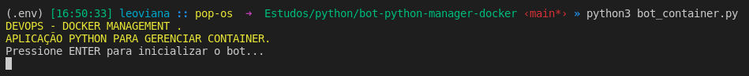
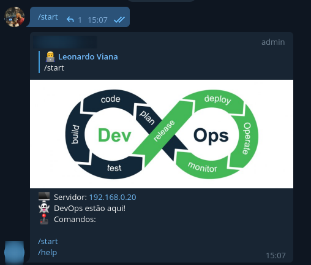
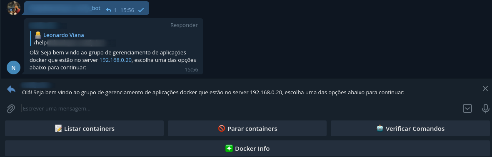
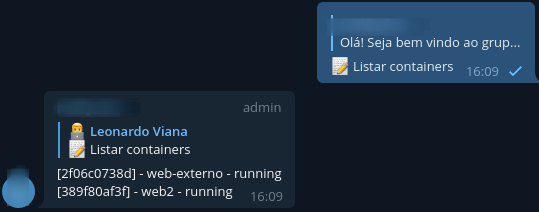
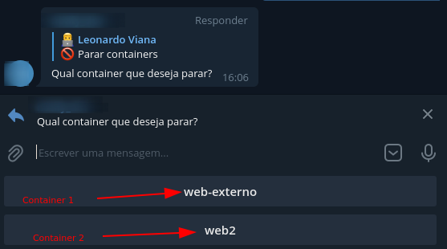
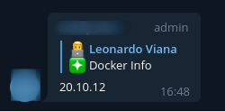

<h1 align="center">Bot Telegram</h1>

  

  

  <a href="#-projeto">Projeto</a>&nbsp;&nbsp;&nbsp;|&nbsp;&nbsp;&nbsp;
  <a href="#-tecnologias">Tecnologias</a>&nbsp;&nbsp;&nbsp;|&nbsp;&nbsp;&nbsp;
  <a href="#%EF%B8%8F-ambiente">Ambiente</a>&nbsp;&nbsp;&nbsp;|&nbsp;&nbsp;&nbsp;
  <a href="#-execução">Execução</a>&nbsp;&nbsp;&nbsp;|&nbsp;&nbsp;&nbsp;
  <a href="#-licença">Licença</a>&nbsp;&nbsp;&nbsp;|&nbsp;&nbsp;&nbsp;
  <a href="#-referências">Referências</a>

  

## 🌱 Projeto

- Construção de um bot para gerenciamento de um ambiente `docker` através do `telegram`.

## ✨ Tecnologias

## 🛠️ Ambiente 
1. sudo apt install python3.9-venv
2. python3 -m venv .env
3. source .env/bin/activate
4. deactivate

# Compartilhamento do ambiente
1. pip freeze > requirements.txt
2. pip install -r requirements.txt

# Removendo o ambiente
1. deactivate
2. rm -r .env

# Containers para teste
1. docker container run --name web01 -d nginx
2. docker container run --name web02 -d htpd
3. docker container run --name -P web03-externo -d nginx
4. docker container run --name -P web04-externo -d nginx

## 🚀 Execução

- Inicializando o bot

  

>> Comandos:

- /start

  

- /help

  

>> Opções:

- `Listar containers`

  

- `Parar containers`

  

- `Verificar comandos`

  

- `Docker Version`

  

## 📄 Licença

Esse projeto está sob a licença MIT. Veja o arquivo [LICENSE](LICENSE.md) para mais detalhes.

## 🙇 Referências

1. https://docs.aiogram.dev/en/latest/

2. https://github.com/aiogram/aiogram

